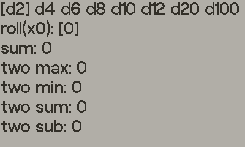

# play.dice-roller
Simple dice roller app for [playdate](https://play.date/).

## features
- roll history 
- total sum 
- last two rolls: min/max and sum/sub

## controls
left/right: select dice  
up: select d20
down: select d6
a: roll dice  
b: clear  

